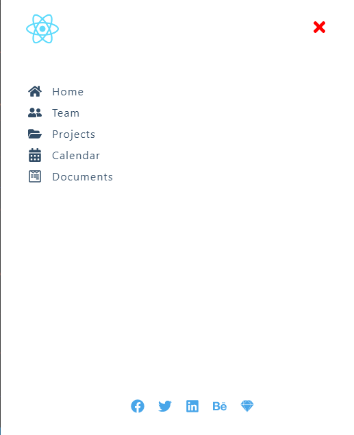

# SideBar-Modal
Completed Another Minor project using React

In the quest to perfect my understanding of the react library I did another
minor react project that display a side bar a modal when the menu bar and the 
show modal button is clicked respectively. I was able to apply the useContext 
hooks to pass props to different component. 

Below are the images of what is rendered to the browser

# Mobile View of what is rendered to the browser

